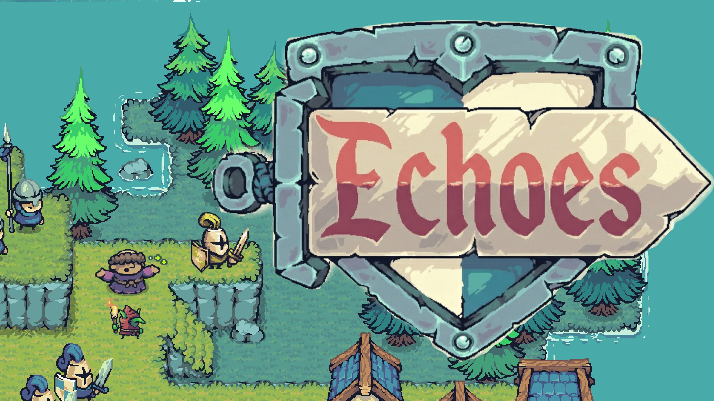

# echoes: The Past Fights Back



A 2D top-down action RPG built with **Godot 4.5**. You play as a lone warrior who calls upon the *echoes* of fallen heroes — a Monk, a Lancer, and a Goblin — and fights through 5 enemy-filled levels to reach an enemy stronghold and avenge your fallen comrades.

The game features two modes: **Story Mode** (5 campaign levels with narrative) and **Endless Mode** (infinite wave survival).

---

## Gameplay

Echoes is built around a **party-switching combat system**. You control one character at a time and can swap to any living ally mid-fight (with a 1-second cooldown between switches). Each character has a unique playstyle, stats, and ability.


### Controls

| Action | Input |
|---|---|
| Move | `W` `A` `S` `D` |
| Attack | `Left Mouse Button` |
| Dash | `Left Shift` |
| Switch Character | `1` `2` `3` `4` or click portrait |
| Use Skill | Skill button in HUD |

### Characters

| Character | Role | Unique Mechanic |
|---|---|---|
| **Warrior** | Balanced fighter | Two-hit combo — click again during the first swing to chain into a stronger second slash (+50% damage). |
| **Monk** | Support | Attacks heal the *next* character you switch to instead of dealing damage (30 HP, 5s cooldown). |
| **Lancer** | Aggressive bruiser | *Hold* to charge a spear lunge; the longer you hold, the further and harder you hit (up to 2.5× base damage). Charge is interrupted if hit. |
| **Goblin** | Glass cannon | High crit chance (50%). Attacks apply a **burn** status that deals fire damage over time. |

### Core Mechanics

- **Dash** — Invulnerability frames during a quick directional dash. Ghost trail VFX included.
- **Knockback** — Attacks send enemies flying; taking damage applies recoil to the player.
- **Critical Hits** — Crits trigger slow-motion freeze frames for visual impact.
- **Party Death** — If the active character dies, control auto-transfers to a living ally. If all characters die, Game Over.

---

## Modes

### Story Mode
Fight through **5 campaign levels** across different islands, each with story dialogue at the start and end. Waves grow progressively harder (bigger budget, more HP, more damage) until the level is cleared and you advance to the next one.

### Endless Mode
Survive an **infinite stream of enemy waves** on a single map. Difficulty scales continuously — see how long you can last.

**Enemy types:**
- **Pawn Axe** — Basic melee grunt that chases and attacks on sight.
- **Pawn Hammer** — Basic melee grunt, similar to the Pawn Axe.
- **Warrior** — Tougher melee enemy with more health and damage.
- **TNT** — Ranged bomber that keeps its distance and lobs exploding projectiles at the player.

**Enemy AI:** Enemies patrol their spawn area, alert when they spot you (line-of-sight check), chase and attack, and go into a "confusion" state if they lose sight of you.

---

## Project Structure

```
echoes/
├── scenes/
│   ├── levels/         # 5 campaign levels
│   ├── characters/     # Character scenes (Warrior, Lancer, Monk, Goblin)
│   ├── enemies/        # Enemy scenes
│   └── ui/             # HUD, echo deck, game over screen
├── scripts/
│   ├── player.gd       # Base Character class (movement, dash, combat, HP)
│   ├── warrior.gd      # Warrior — two-hit combo
│   ├── lancer.gd       # Lancer — charge lunge attack
│   ├── monk.gd         # Monk — heal on switch
│   ├── goblin.gd       # Goblin — burn on attack
│   ├── enemy.gd        # Enemy base AI (patrol, chase, attack, burn)
│   ├── party_manager.gd # Handles party switching, death, and UI sync
│   ├── wave_manager.gd  # Spawns and scales enemy waves per level
│   └── audio_manager.gd # Global audio (music + SFX)
├── dialogue/           # Per-level narrative dialogue (.dialogue files)
└── assets/             # Sprites, tilesets, audio
```

---

## Built With

- **Engine:** [Godot 4.5](https://godotengine.org/) (GL Compatibility renderer)
- **Language:** GDScript
- **Dialogue:** [Dialogue Manager](https://github.com/nathanhoad/godot_dialogue_manager) addon

---

## Credits

- **Sprites:** [Tiny Swords](https://pixelfrog-assets.itch.io/tiny-swords) by Pixel Frog
- **VFX & SFX:** [Ninja Adventure Asset Pack](https://pixel-boy.itch.io/ninja-adventure-asset-pack) by Pixel-Boy

---

## License

See [LICENSE](LICENSE).